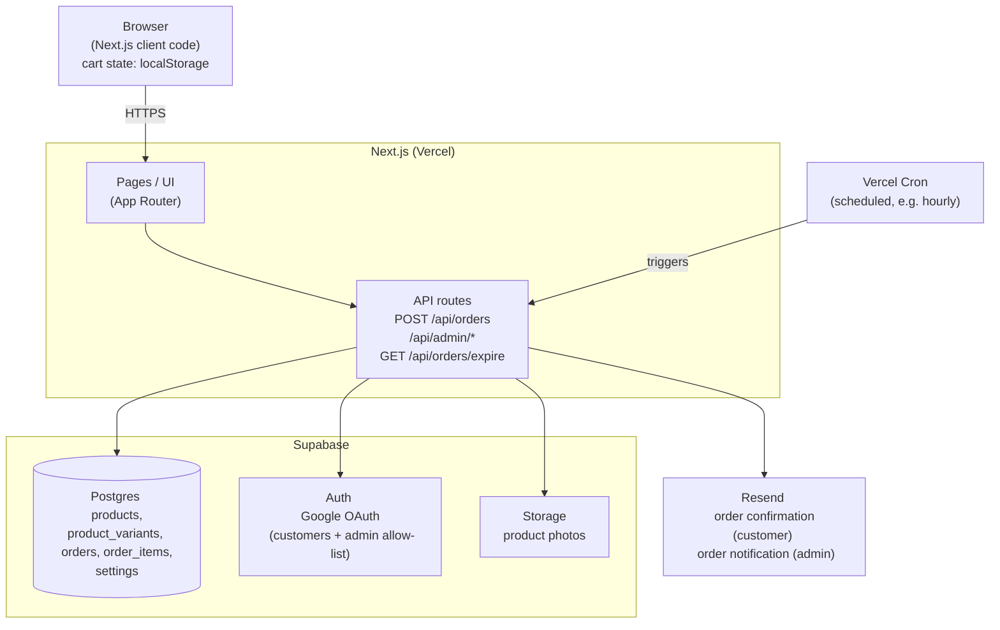

# Target Architecture — Leather Shop

Companion to [PRODUCT_REQUIREMENTS.md](./PRODUCT_REQUIREMENTS.md). That doc
says *what* to build; this one says *how the pieces fit together*. Reflects
the target state — see the end of this doc for what's actually built today
vs. still pending.

## Diagram



## Components

### Next.js (Vercel)
Single codebase, both roles:
- **UI** — App Router pages: home, `/products`, `/products/[slug]`, `/cart`,
  `/checkout`, `/faq`, `/contact`, `/privacy`, `/admin/*`.
- **API layer** — Next.js API routes are the only thing allowed to talk to
  Supabase/Resend directly. The browser never holds a Supabase
  service-role key. Main routes:
  - `POST /api/orders` — validates cart contents against real stock,
    recomputes totals server-side, writes the order, decrements stock,
    triggers both emails.
  - `/api/admin/*` — product CRUD, order status updates, FAQ content edits.
    All gated on the admin allow-list (see Auth below).
  - `GET /api/orders/expire` — the order-hold check (PRD §5, §6): reads
    the configured hold duration from the `settings` table (default 48
    hours — admin-editable, not a code constant), finds orders still
    `pending_payment` past that many hours since `created_at`, flips them
    to `cancelled`, and restores each item's product-level stock via
    the `restore_product_stock` Postgres function. `GET`, not `POST`,
    because that's what Vercel Cron actually sends. Not otherwise
    user-facing — requires a `CRON_SECRET` bearer token, which Vercel
    attaches automatically once the env var is set; any request without a
    matching token gets a 401.

### Scheduler (Vercel Cron)
There's no long-running server process to just leave a timer on, so the
expiry check needs something external triggering it periodically —
a Vercel Cron Job (defined in `vercel.json`) calling
`GET /api/orders/expire` on a fixed schedule (e.g. hourly). That
schedule interval is a deploy-time config (`vercel.json`), separate from
the admin-configurable hold *duration* the route checks against — changing
how often the check runs still needs a deploy, changing how long the hold
lasts does not. Supabase's `pg_cron` is the alternative if the check
should live in the database instead of the app.

### Supabase
One integration covering three concerns, chosen specifically to avoid
standing up three separate services:

- **Postgres** — the actual database. Tables: `products`, `option_types`,
  `orders`, `order_items` (see Data Model below). Replaces the hardcoded
  product list and in-memory order array that exist today.
- **Auth** — Google OAuth for both customer accounts (order history, per
  PRD §6) and admin access (same login mechanism, but gated by an email
  allow-list rather than a separate credential system — see PRD §6 Admin).
  The allow-list itself is the `admin_users` table (RLS default-deny,
  service-role-only read). `src/proxy.ts` (Next.js 16 renamed
  `middleware.ts` to `proxy.ts`) checks every `/admin/*` request: no
  session → redirect to `/login`; session but email not in `admin_users`
  → redirect to `/login?error=unauthorized`.
- **Storage** — product photos, served via Supabase's CDN, referenced by
  URL from the `product_photos` table.

### Resend
Fired from inside `POST /api/orders` after a successful order write:
- Customer-facing order confirmation, to the address they typed at checkout.
- Admin order-notification alert, to the shop owner's email.

No API key configured → the call no-ops with a console warning instead of
failing the order (already true in the current placeholder implementation).

## Data Model (target)

```
products
  id, slug, name, description, category, price_centavos,
  lead_time_days, ordering_enabled, created_at,
  stock_quantity (a single production-capacity number for the whole
  product — all v1 products are made-to-order, so it's the same
  regardless of which option combination a customer picks; not per
  variant — see PRODUCT_OPTIONS_DESIGN.md's "Course correction"),
  in_stock (derived: stock_quantity > 0)

option_types
  id, name (e.g. "Color", "Thread Color", "Size" — unique, shop-wide),
  display_style ("buttons" | "dropdown", admin-chosen per option type —
  US-39, and global to the type, not per-product — US-40)

  > **Implemented in code, not yet live** — migration
  > `0011_option_library_and_order_item_options.sql` written, not yet run
  > (see MANUAL_TASKS.md; must run after `0010`). Replaces the old
  > per-product `product_option_types` (migration `0009`) — an admin
  > defines "Color" once and attaches it to any product, instead of
  > recreating the same type/value list by hand on every product (see
  > PRODUCT_OPTIONS_DESIGN.md's "Third course correction").

option_values
  id, option_type_id (fk), value (e.g. "Black"), position (shop-wide
  display order)

  > **Implemented in code, not yet live** — see option_types above.
  > Replaces the old per-product `product_option_values`.

product_options
  id, product_id (fk), option_type_id (fk), position — which option
  types a given product uses, and in what order

  > **Implemented in code, not yet live** — the per-product attachment
  > link (new in `0011`; no equivalent existed before this correction).

product_option_selections
  product_option_id (fk), option_value_id (fk) — the per-product subset
  of that type's values this product actually offers (attaching a shared
  type doesn't expose every value it's ever had — the admin picks a
  subset per product)

  > **Implemented in code, not yet live** — new in `0011`. No DB
  > constraint enforces that option_value_id belongs to the same
  > option_type_id as its product_options row, checked in app code
  > (src/lib/admin/catalog.ts).

orders
  id, status ("pending_payment" | "paid" | "shipped" | "cancelled" | ...),
  customer_name, customer_email, customer_phone,
  shipping_street, shipping_city, subtotal_centavos,
  shipping_centavos, total_centavos, created_at

order_items
  id, order_id (fk), product_id (fk), quantity,
  unit_price_centavos (snapshot at order time)

order_item_options
  id, order_item_id (fk), option_type_name (text, snapshot), option_value
  (text, snapshot), position — the option values selected for this order
  item, recorded directly rather than resolved through a variant row; both
  columns are snapshotted at order time so a later option rename/delete
  doesn't rewrite historical order display, same reasoning as
  unit_price_centavos above

  > **Implemented in code, not yet live** — new in `0011`. Replaces
  > order_items.variant_id/variant_label and the product_variants/
  > product_variant_options tables entirely (see PRODUCT_OPTIONS_DESIGN.md's
  > "Second course correction"): any combination of a product's own option
  > values is orderable, with no admin-created variant row gating which
  > combinations are allowed.

settings
  key, value — single-row or key/value table holding admin-editable shop
  config: shipping_fee_centavos, delivery_cities, admin_notification_email,
  order_payment_hold_hours (default 48). Read by /api/orders,
  /api/orders/expire, and the checkout UI; written only via /api/admin/*.
```

`unit_price_centavos` is snapshotted onto the order item at order time so a
later price change on the product doesn't rewrite historical order totals.
`settings` is what makes §6/§7's "no hardcoded business configuration"
requirement real — every value in it is what a config constant would
otherwise have held.

## Request flow: placing an order

1. Browser: cart lives in `localStorage`, nothing server-side yet.
2. Checkout form submits → `POST /api/orders` with cart contents + shipping
   info.
3. API route: re-fetches each product/variant from Supabase (never trusts
   client-submitted prices), checks Metro-Manila-only city and stock/
   ordering-enabled, decrements the product's `stock_quantity` at this
   point (not at payment confirmation — see PRD §5 for why), writes
   `orders` + `order_items` rows.
4. API route: fires both Resend emails.
5. Browser: shows order confirmation with the order id; cart is cleared.
6. Shop owner: gets the email, later confirms payment and updates order
   status in `/admin`.

## Request flow: order expiry (payment hold)

1. Vercel Cron fires on schedule (`vercel.json`: daily at `0 16 * * *` UTC
   = midnight GMT+8 — the Hobby plan only allows daily Cron, not hourly;
   Vercel Cron schedules are always evaluated in UTC) → `GET
   /api/orders/expire` (with the `CRON_SECRET` bearer token Vercel attaches
   automatically). This means an order can sit up to ~24h past its actual
   `order_payment_hold_hours` before being cancelled — acceptable for v1's
   traffic volume, but worth revisiting on a paid plan if faster expiry
   matters.
2. Route reads `order_payment_hold_hours` from `settings` (default 48),
   then queries Supabase for orders where `status = 'pending_payment'`
   and `created_at` is older than that many hours.
3. For each match: sets `status = 'cancelled'`, and for each of its
   `order_items`, adds the quantity back onto its product's
   `stock_quantity`.
4. No email/notification implied by this flow in the PRD — just the status
   change and stock restore. (Admin sees the cancelled status next time
   they check `/admin`.)

## Deployment

- **Vercel** hosts the Next.js app (build + serverless functions for the
  API routes).
- **Supabase** is a separate hosted project (Postgres + Auth + Storage);
  Next.js talks to it over its REST/Postgres client using env vars
  (`SUPABASE_URL`, `SUPABASE_ANON_KEY`, `SUPABASE_SERVICE_ROLE_KEY`).
- **Resend** is called via API key, also through env vars — no
  infrastructure of its own to deploy.

## Current state vs. target

| Piece | Target | Actually built today |
|---|---|---|
| Products | Supabase table, admin-editable | ✅ done (Phase 2) — reads live; admin editing UI still Phase 5 |
| Orders | Supabase table | ✅ done (Phase 3) |
| Stock | Real quantity, decremented at order placement | ✅ done (Phase 3) — atomic via Postgres function, race-safe |
| Order expiry | Configurable-duration (default 48h) auto-cancel + stock restore via Vercel Cron | Route built (Phase 3); actual cron trigger only fires once deployed to Vercel (see MANUAL_TASKS.md) |
| Shop config (shipping fee, delivery cities, hold duration, etc.) | Admin-editable `settings` table | ✅ done (Phase 1/3) — reads live; admin editing UI still Phase 5 |
| Auth | Google OAuth (customers + admin allow-list) | ✅ done (Phase 4 admin, Phase 8 customer) — allow-listed email reaches `/admin`, other Google accounts denied; any Google account reaches `/account` (order history + saved addresses), no allow-list |
| Product photos | Supabase Storage | ✅ done (Phase 5) — multi-photo gallery, admin upload/delete, clickable PDP thumbnails |
| Cart | localStorage (unchanged) | ✅ already matches target |
| Checkout → order API | Supabase-backed | ✅ done (Phase 3) |
| Emails | Resend, both directions | ✅ done (Phase 6) — admin notification + customer confirmation (HTML, with product photo) both verified live. Go-live blocker: sandbox sender can't reach real customers until a domain is verified (see MANUAL_TASKS.md) |
| Payments | Manual/offline — customer pays off-platform, admin confirms and marks `paid` in `/admin` | ✅ already matches target |
| FAQ / Contact / Privacy | Admin-editable FAQ (`faq_items` table), static Contact/Privacy pages, linked from header + footer | ✅ done (Phase 7) |
| Customer accounts | Order history + saved addresses, scoped to the logged-in customer's email | ✅ done (Phase 8) — `/account` (order history, grouped by status) and `/account/addresses` (CRUD, default address); checkout pre-fills from a saved address when logged in |
| Non-functional hardening | Event logging, SEO, accessibility, mobile QA (PRD §8) | ✅ done (Phase 9) — structured funnel-event logging (`add_to_cart`/`checkout_started`/`order_placed`) via `POST /api/events` + direct server-side logging; `sitemap.xml`/`robots.txt`; Lighthouse 100/100/100 (accessibility/best-practices/SEO) on mobile viewport for indexable pages. Mobile-device walkthrough (post-deploy) verified working |
| Product options | Shop-wide, admin-defined option types (Color, Thread Color, Size, ...) attachable to any product with a per-product value subset (US-40); any combination of a product's own option values is orderable directly — no admin-created variant row required (PRD §3/§5, US-3) | 🔲 done in code, not yet live — see [PRODUCT_OPTIONS_DESIGN.md](./PRODUCT_OPTIONS_DESIGN.md). All 10 checkpoints (0-9) are implemented on `feat/product-options`; blocked on running migrations `0010` then `0011` against the live DB before merging (see MANUAL_TASKS.md) |

Remaining work is running migrations `0010` and `0011` against the live DB
and merging `feat/product-options` — see PRODUCT_OPTIONS_DESIGN.md and
MANUAL_TASKS.md.
