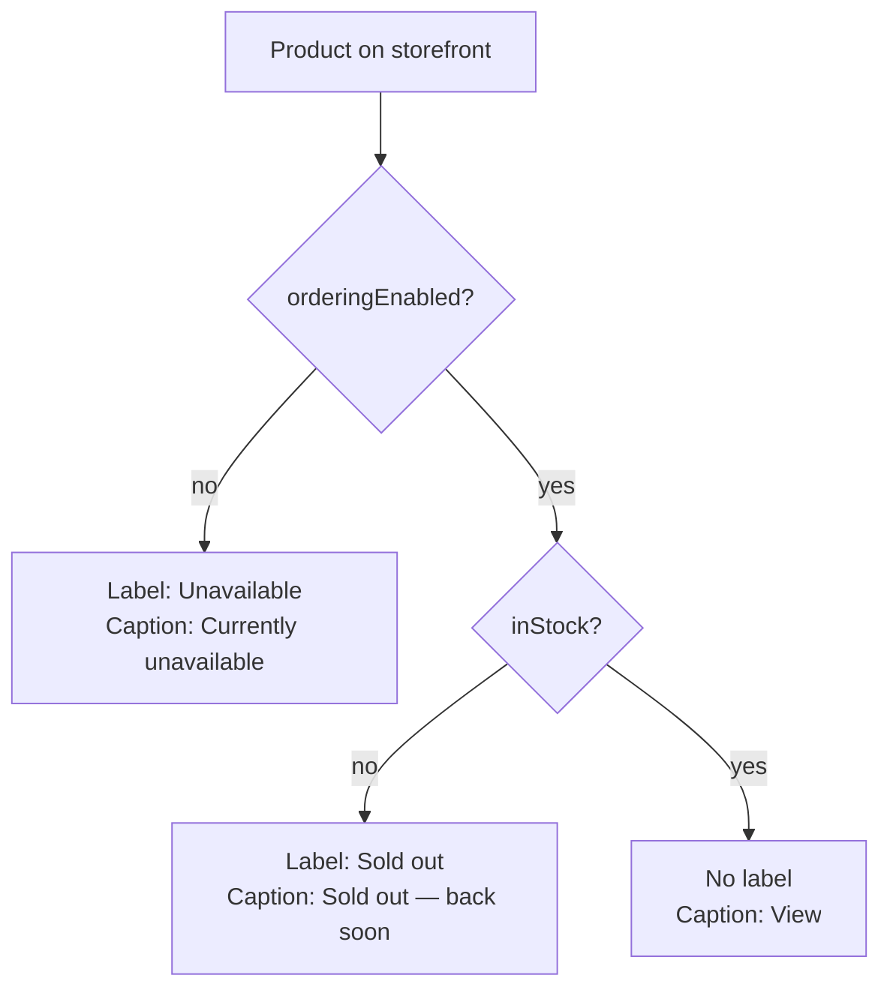

# Unavailable Products: Featured Grid, Restock Wording, Admin Chips

**Status:** Approved 2026-10-04 (revision 2). Mockup:
[artifact](https://claude.ai/artifact/BDcebg1YjaPrwUqdwqyFcF) (logged in
`docs/DESIGN_LOG.md`, 2026-10-04). Not yet
built into the app.

**Approved decisions (2026-10-04):**

- Photo label goes in the photo's **top-left corner**.
- **Site-wide:** the `/products` shop grid switches to the same treatment
  (no fade, no strike-through, plus the label, no hover zoom and the new
  caption). Section 6 is decided: yes.
- **Price shows normally**, with no strike-through.
- Caption `Sold out — back soon`. The product page gets the muted line
  `Back soon — we're making more.` The admin gets the grey `Hidden` chip.

**Why a separate brief and not a revision in `homepage.md`:** the change
starts on the homepage, but the treatment and restock wording also touch
the shop grid (`shop-page.md`), the product page and two admin components.
A standalone brief keeps one source of truth for "how an unavailable
product looks everywhere". Once this is agreed, `homepage.md` and
`shop-page.md` each get a one-line revision note pointing here.

Builds on the existing "Quiet & Confident" system (`STYLE_GUIDE.md`) and
supersedes, if the user agrees (section 6), the shop-grid fade shipped
earlier (see `DESIGN_IMPROVEMENTS.md`, Done: "Sold-out items in the shop
grid").

### Revision log

- **Rev 1 (2026-10-04):** first draft, Direction A (copy the shop grid:
  faded photo, struck-through price, grey caption).
- **Label style decided (2026-10-04): ink rectangle.** Section 4 is
  updated. Earlier comparison notes follow. The user
  asked whether the photo label would work better as a filled rectangle.
  The mockup now has a global "Label style" toggle and a side-by-side
  strip on light, mid and dark photos, comparing three variants:
  1. **Pill (previous spec):** white, `rounded-full`, hairline ring, ink
     text.
  2. **Ink rectangle (the coordinator's recommendation to the user):**
     solid `#1C1A18`, white text, `rounded-[2px]`, same type size and
     tracking.
  3. **Cream rectangle:** solid `#F3F1EC`, ink text, `rounded-[2px]`,
     hairline ring.

  Reasoning:
  - The storefront's buttons are pills, so a pill label can read as
    tappable.
  - A filled rectangle reads as a tag and is easier to notice when
    scanning.
  - The trade-off: the ink rectangle blends into dark photos (its text
    stays legible), while the cream one blends into light photos.

  The label stays `aria-hidden`. The user chose the ink rectangle. A
  faint light outline for very dark photos is deferred unless the real
  photos call for it.
- **Approved (2026-10-04):** rev 2 approved as written, with the shop
  grid included.
- **Rev 2 (2026-10-04):** the user asked to leave the photo as untouched as
  possible. The fade is dropped. The state is now carried by a small text
  label on the photo, the grey caption, and turning off the hover zoom.
  Also dropped the price strike-through. Recommends the shop grid adopts
  the same pattern (decision for the user). The three open questions from
  rev 1 are settled: caption "Sold out — back soon", the extra line on the
  product page, and the grey `Hidden` admin chip are all in.

## 1. Purpose and audience

- **Shopper:** a featured product that can't be bought today should never
  look buyable. Today a sold-out featured item still says "View", and a
  paused one shows "Currently unavailable" as a terracotta link.
- **Owner (non-technical):** the admin help text already promises that "a
  featured product that later gets paused or sells out stays in its slot
  and shows as unavailable". The storefront should keep that promise
  **without degrading the owner's photos**, and the owner should see each
  product's state at a glance in /admin/homepage.

## 2. Current state

| Surface | Sold out (`!inStock`) | Paused (`!orderingEnabled`) |
|---|---|---|
| Shop grid | Faded photo, struck-through price, grey "Sold out" | Same, grey "Currently unavailable" |
| Product page | Disabled button "Sold out" | Disabled button "Currently unavailable" |
| Homepage featured | **Nothing, shows "View"** | Terracotta "Currently unavailable" link only |
| Admin featured slots and picker | No indicator | No indicator |

## 3. Look and feel

Quiet, factual, not alarming. The piece stays in the window at full
quality, as in a boutique where a sold piece stays on display with a small
card beside it. No fading, no red, no icons, no animation.

## 4. Unavailable cards: the treatment

### The combination

| Signal | Available (unchanged) | Unavailable (sold out or paused) |
|---|---|---|
| **Photo** | Untouched | **Untouched**: no opacity, no grayscale |
| **Photo label** (new) | None | Small solid ink label (white text) in the photo's top-left corner: `Sold out` or `Unavailable` |
| **Caption** | Terracotta "View", underline on hover | Ink-soft `#6E6A64`, no underline: `Sold out — back soon` or `Currently unavailable` |
| **Hover zoom** | 3% zoom | **None**; the card feels still |
| **Price** | Ink-soft | **Unchanged**; no strike-through |
| Name, description | Unchanged | Unchanged |

The card stays a link to the product page.

### Why this combination

- **No photo treatment.** I considered a very slight fade (for example
  `opacity-90`) and rejected it. It's too subtle to communicate anything
  on its own, but it still dulls the owner's photos. On light tan or cream
  leather shot on white, any fade reads as "the image failed to load"
  rather than "sold". The label does the job without that cost.
- **The photo label is the at-a-glance signal.** On a 2-up mobile grid
  the photo is what shoppers scan, and the caption sits below the name and
  description, sometimes below the fold. A small label on the photo is the
  only non-photo signal visible while scanning. It's text, so it can't be
  mistaken for a style choice.
- **The caption carries the full message.** It holds the complete wording
  ("back soon") and is the accessible text (section 8). It replaces the
  terracotta "View", so the one accent colour disappears from unavailable
  cards, which is a quiet "nothing to do here" cue.
- **No hover zoom.** On desktop, a card that doesn't respond to hover
  feels inert, which reinforces "not buyable" without visual noise. It
  costs nothing to build.
- **Price unchanged.** In retail, a struck-through price reads as "on
  sale" (old price crossed out), which is the opposite of the message.
  With the label and caption already saying "Sold out", the strike adds
  ambiguity, not clarity. A shopper waiting for a "back soon" piece also
  wants to know its price.

### The photo label

- **Position:** top-left of the square photo, inset `top-2 left-2` on
  mobile and `top-3 left-3` from `sm`. Top-left is where a scanning eye
  lands first and where corners are least likely to hold the product
  itself.
- **Style:**
  - Background: solid ink `#1C1A18` (`bg-[#1C1A18]`), with no ring.
  - Text: white (`text-white`), `text-[.6875rem] font-medium uppercase
    leading-tight tracking-[0.08em] whitespace-nowrap`.
  - Shape: `px-2.5 py-1 rounded-[2px]`, a tag rectangle and deliberately
    not the storefront's pill-button shape.
  - No shadow and no blur.
- **Labels:** `Sold out` or `Unavailable`. These are short versions of
  the captions, so the label never wraps, even on a 160px mobile tile.
  "back soon" stays in the caption only, which keeps the label small.
- **Why a solid ink rectangle (decided 2026-10-04, over a white pill and
  a cream rectangle):**
  - A filled rectangle reads as a shop tag. A pill could read as a
    tappable button, because the storefront's buttons are pills.
  - Ink is the most noticeable of the three when scanning light and
    mid-tone photos, which are most of the catalogue.
  - Text contrast is fixed by the label's own background (white on ink is
    about 17:1), no matter what the photo looks like.
  - On very dark photos the rectangle's edge blends into the photo, but
    the white text stays fully legible.
  - A faint light outline for very dark photos is **deferred** and will
    only be added if the owner's real photos call for it.
  - A translucent or blurred label would make contrast depend on each
    photo.

### Which label wins

**Paused wins over sold out.** Pausing is a deliberate owner decision and
may mean the piece won't return, so a paused item must not promise "back
soon". This matches the existing order in the shop grid and on the
product page.

## 5. Restock wording (decided)

| Surface | Sold out | Paused |
|---|---|---|
| Featured and shop grid, photo label | `Sold out` | `Unavailable` |
| Featured and shop grid, caption | `Sold out — back soon` | `Currently unavailable` |
| Product page, disabled button | `Sold out` | `Currently unavailable` |
| Product page, muted line directly under the button | `Back soon — we're making more.` (`text-sm`, ink-soft) | None |

**Fixed copy, not a setting.** It's interface wording, not a business
value, so the "settings are configurable" rule doesn't apply. If true
one-off pieces ever appear, the fix is to pause the product or add a
per-product "won't restock" choice, not an editable sentence.

## 6. Shop grid uses the same treatment (decided: yes)

**Approved 2026-10-04.** Switch the shop grid (`/products`) to this
treatment too:

- remove `opacity-60 grayscale-[0.4]` and `line-through`;
- add the photo label;
- turn off the hover zoom on unavailable tiles;
- use the new caption.

Reasons:

- **One pattern site-wide.** Shoppers move from the homepage to the shop
  in one click. Seeing the same product faded in one place and untouched
  in the other would look like a bug.
- **The photo-quality reason is even stronger in the shop.** It's a
  denser 2–4-up grid where several faded tiles make the whole page look
  washed out.
- **Same cost.** It's the same small change in a sibling file.

## 7. Admin chips: /admin/homepage

The chips reuse the existing admin status-chip pattern from
`ProductsCatalog.tsx`: `rounded-full px-2 py-0.5 text-[.6875rem]
font-semibold uppercase tracking-[.05em]`, with a tinted background and
semantic text colour. Every chip has a text label.

| State | Label | Colour (light) |
|---|---|---|
| Hidden (`!visible`) | `Hidden` | Neutral: text `#6E6A64`, bg `black/[.05]` (same as catalog) |
| Paused (`!orderingEnabled`) | `Paused` | Warning: text `#8A6415`, bg `rgba(138,100,21,.12)` |
| Sold out (`stockQuantity === 0`) | `Sold out` | Critical: text `#8C3B32`, bg `rgba(140,59,50,.12)` |
| Available | No chip | n/a |

**Precedence:** Hidden, then Paused, then Sold out, showing one chip only.
Hidden comes first because a hidden product doesn't appear on the
storefront at all, which is the most important thing for the owner to
know. Dark-mode values exist in the style guide's semantic table; copy
them for parity.

**Placement:**

- **Featured slot tile (`HomepageFeatured.tsx` → `FilledTile`):** on the
  name row under the photo, right-aligned (`flex items-center
  justify-between gap-2`). The name keeps `truncate` and the chip gets
  `shrink-0`. The chip doesn't go on the photo, because the drag grip
  already sits in the top-left corner. The admin photo isn't altered.
- **Picker modal (`FeaturedSlotModal.tsx`):** in each candidate row, the
  chip sits after the name, pushed right with `ml-auto`. Unavailable or
  hidden products can still be chosen (the owner's call), but the owner
  sees the state first.
- **Help text** (`page.tsx` L91): no change for paused or sold out. Add
  one sentence for hidden: "A hidden product's slot is skipped on the
  homepage until it's visible again."

## 8. Edge cases

- **All 3 featured items unavailable.** All three stay, each with an
  untouched photo, a label and a grey caption. There's no banner and no
  automatic replacement (Direction C was rejected). The hero's "Shop the
  Collection" button still leads to buyable pieces. Because photos aren't
  faded, the section still looks good rather than looking broken, which
  is a quiet benefit of this revision. The three admin chips make it
  obvious to the owner.
- **Paused and sold out at the same time.** The storefront shows the
  `Unavailable` label and "Currently unavailable" caption. The admin
  chip shows `Paused`.
- **No photo.** The featured grid currently renders `product.photos[0]`
  without a guard, so `<Image>` could get `undefined`. Match the shop
  grid: a square `bg-[#f3f1ec]` placeholder, with the image only when a
  photo exists. The photo label still sits in the top-left of the
  placeholder. The ink label stands out clearly on the cream.
- **Hidden product.** The storefront drops it, so the featured grid shows
  2 (or fewer) items. The admin shows the `Hidden` chip on that slot
  tile.

## 9. Accessibility

- **State is never conveyed by colour or imagery alone.** The label and
  caption are both visible text. With no fade, nothing depends on
  opacity.
- **No double reading.** The photo label is `aria-hidden="true"`. The
  caption inside the link is the accessible carrier, so screen readers
  hear the state once. The link's accessible name reads "{name} {price}
  {description} Sold out — back soon".
- **Alt text stays the product name.** The status isn't repeated there.
- **Price:** no `line-through` and no `<del>`. Nothing to announce and no
  false "sale" signal.
- **Contrast:**
  - Photo label: white text on its own solid ink `#1C1A18` background,
    about 17:1. That holds on any photo, from black bridle leather to a
    cream backdrop.
  - Label edge on very dark photos: the rectangle blends in, but the edge
    is a non-text decorative boundary, so the 3:1 non-text rule is
    advisory rather than required. The text still carries it.
  - Grey caption: `#6E6A64` on white, about 5.4:1, which passes AA for
    small text.
  - Admin chips: the existing catalog pairs.
- **Focus:** cards keep the existing link focus behaviour. The label
  isn't focusable.
- **Reduced motion:** unavailable cards have no zoom anyway. Available
  cards keep the existing `motion-reduce:transition-none`.

## 10. Mobile

- **Featured grid:** stacks 1-up, so the label and caption have plenty of
  room.
- **Shop grid:** 2-up at about 160px per tile. The label is short enough
  never to wrap ("Unavailable" is the longest at 11 characters).
  "Sold out — back soon" in the caption may wrap at the dash on 320px
  screens, which is acceptable. It never truncates.
- **Admin:** tiles are 3-across even on narrow screens. The name
  truncates first and the chip stays whole.

## 11. Motion

None added. Unavailable cards lose the hover zoom. `<Reveal>` behaves the
same for every card.

## 12. Out of scope

- "Notify me when it's back" (email capture and sending). A possible later
  feature, to be logged in `DESIGN_IMPROVEMENTS.md` as an idea once this
  ships.
- Made-to-order or backorder purchasing of sold-out items.
- Automatically hiding or replacing unavailable featured items.
- Per-option-combination stock (stock stays one boolean per product).
- An editable restock-wording setting.
- Restock dates or "only N left" messaging.
- Changes to the product-page gallery (its photos stay untouched, and the
  button plus the muted line carry the state).
- Cart, checkout and order-history handling of items that sell out after
  being added.
